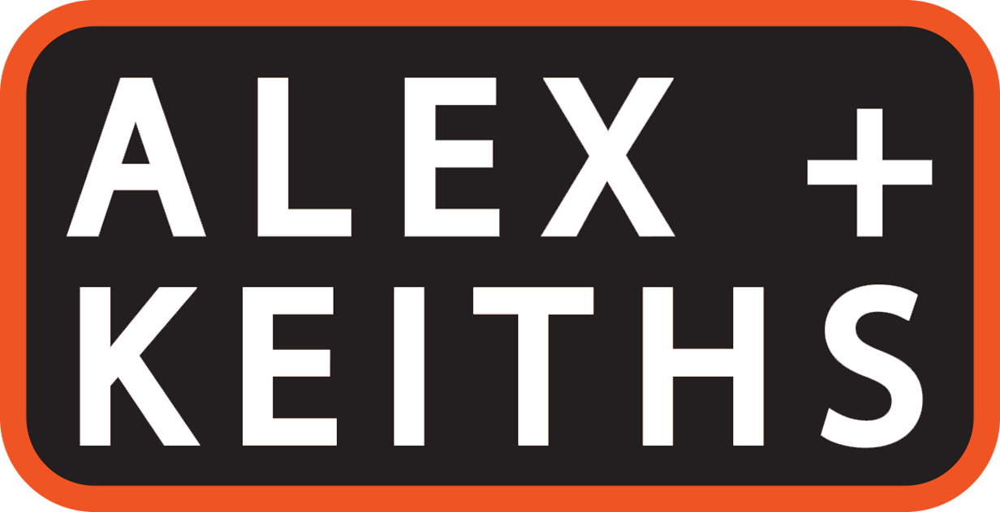

# ALEX+KEITHS (FIP)

### Description
  The concept of this website was to mix and mash two vastly different company identities (Alexander Keith's and BLACK+DECKER) into a single beer company while maintaining both signature design styles. The files included here are only the required files needed to view the final responsive 5-page result.

### Prerequisites
- Unzipping software.
- Browser capable of running HTML5, CSS and Javascript code simulaneously.
- Internet connection (for social media links and embedded YouTube promo video).

### Authors
- John Wood
- Liam Yancy

### Roadmap
 Here's a link to the Roadmap on Google Drive:
 https://drive.google.com/file/d/1yaoSCXC7XbzCrCQiyCsfwZlRQkY01gCM/view?usp=sharing
 
### License
  This project is licensed under the MIT license. (Fanshawe College)
